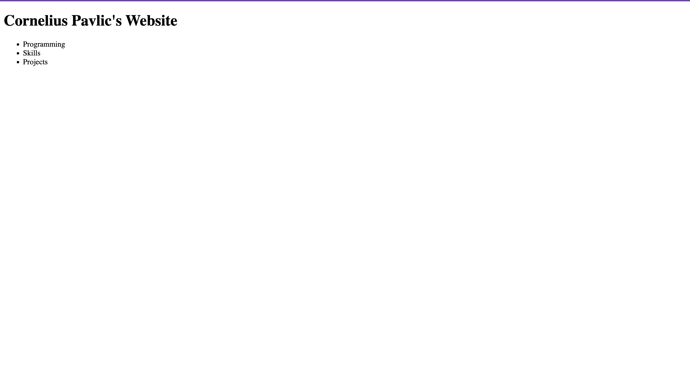

# PersonalWebsite

Building my personal website, my goal for this project is to both demonstrate my ability to code and my ability to learn. I will be working on this website for 1 hour every day for the next year. I will keep a log of the work I do in this read me. As a starting point I have a good understanding of JS and a decent understanding of HTML an CSS, I used React for one project in the past but am not very comfortable with it. So I will be working to build something useful in this hour each day starting with little to no experience in the area I am learning. here goes day #1

## Day 1 Feburary 29th 2024

Today I did the Next.js tutorial, and updated node on my computer to run. Here is the website after finishing the tutorial and tweaking it. 

